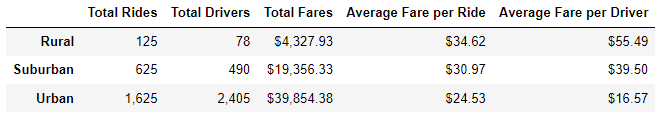
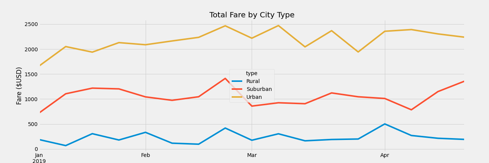

# PyBer_Analysis

## I. Overview of Project

### Background
As a data analyst for PyBer, a ride-sharing app company, we were tasked to analyze all the rideshare data from January to early May of 2019 and create a compelling visualization  for the CEO using Pandas and Matplotlib.

### Objective
As an additional assignment, the CEO requested a summary DataFrame of the ride-sharing data by city type and a multiple-line graph that shows the total weekly fares for each city type.

## II. [Analysis and Results](PyBer_Challenge.ipynb)

### A. Summary DataFrame

- The rural cities have the lowest number of rides, number of drivers and total fares; but they have the highest average fare per ride and average fare per driver.
- The urban cities have the highest number of rides, number of drivers and total fares; but they have the lowest average fare per ride and average fare per driver.
- The suburban cities are always in the middle for number of rides, number of drivers, total fares, average fare per ride and average fare per driver.
- The ratio drivers to rides: (rural=1:1.60), (suburban=1:1.27), (urban=1:0.68). The urban city type is the only one with a higher number of drivers versus total rides, which shows an oversupply of drivers relative to demand.

### B. Total Fare by City Type Chart

- In all parts of the timeline, the urban cities gave the highest total fares and the rural cities gave the lowest total fares.
- All three city types experience a peak on the 3rd week of February then abruptly goes down until the start of March.
- While the March performance fluctuations were highly volatile for the urban city type, it was much flatter for the suburban and rural type. Suburabn was peaking going to the end of April while the other 2 were going down. Starting March, the three city types experience fluctuations that seem independent of each other.

## III. Summary
Based on the results, provide three business recommendations to the CEO for addressing any disparities among the city types.

There is a statement summarizing three business recommendations to the CEO for addressing any disparities among the city types. (4 pt)
